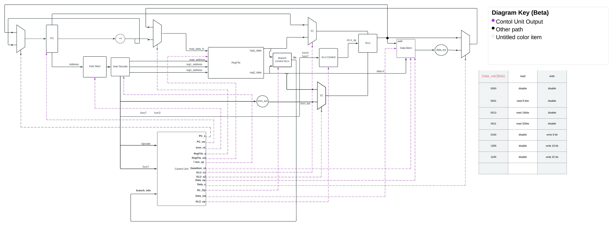

# NYU-6463-RV32I_Processor_Design

---
## Engineers : 
>### **Yunze(Fred) Zhao**, netId: yz8751. 
>Tasks: **Control Unit, all multiplexer, Program Counter, Instruction Decode, mem_imm_extension, Top Level Head** 

>### **Junqing Zhao**, netId: jz5954.  
>Tasks:  **Instruction Memory, Data Memory**

> ### **Rongze LI**, netId: rl4670. 
>Tasks: **ALU, ALU control, Regfile** 

---
# **The NYU-6463-RV32I processor is a 32-bit architecture which executes a subset of the open source RISC-V RV32I instruction set.** 

> ## the spec of this project can be seen in [Here](Project_2022_spec.pdf)
>  

  
*Below is the data path of the CPU implementation*

---
  

***module***
1. ALU 

- Des:
ALU implements the four categories calculation according to the ALU control obtained from ALU control including addition, substraction, AND and OR.

- Testbench:
The testbench of the ALU go through all the basic calculation. The outputs are as expected currently, but more cases need to be validated in the future.

---
2. ALU Control 

- Des:
ALU Control implements the calculation instruction recognition according to the input instruction, which includes add, sub, and, or calculation.

- Testbench:
The testbench of the ALU go through all the instruction combination basically. The outputs are as expected currently, but more cases need to be validated in the future.

---
3. Control Unit 

- Des: 
Control unit is a FSM that indicates what to do for the whole CPU by giving singal to different components. 
The control unit will have 6 stages in total, the first stage, INTITIALIZE will only appear when user resets the CPU. 
The five stages are: Intruction fetch, instruction decode, execution, memory access, and write back. Some of the command will not need all of the five stages but the 5 stages will still happen in order. 

- Testbench: 
The testbench of the Control unit go through all the opcode of all R, I, S, B, U, J types command. They all output the correct values as expected, even though the expected values may be changed in the future for design needs or when stages are added, but right now they all work as intended.  *The testbench is deprecated after the top-level file is implemented as some variables may have different names and slight nuances in outputm, this could be used as a reference overall but may not be all correct values.* 

---
4. Register File
- Variables: 
takes in reset, enable, readS1, readS2, readRd, data_in
returns r1_data, r2_data

- Des: 
The register file is the component that contains all the general purpose registers, it can store and read data depends on instrcution and the address provided. 

- Testbench: 
The testbench of the register file test if the register file can store the data provided to the address provided, with correct output data. And makes sure it can handle enable and reset signal correctly. 

---
5. Instruction Memory 
- Variables:
takes in read_instr(read instruction), addr_in
returns instr_out

- Des:
The instruction memory is a ROM which means the memory file cannot be load or delete. The instruction memory can store up to 512 32-bits instructions. These instruction read from memory. We still have some testing variables in here. 

- Testbench:
The test file instruction.mem contain memory data for test. You might need to readded it manually to test it.

---
6. Data Memory
- Variables:
takes in w_mode, r_mode, addr_in, din, func3
returns dout

- Des:
The functions of data memory include stroing, reading and resetting operations. User could switch read mode to read data or write mode to write data in memory file. This data memory program supports all byte-addressing operations.

- Testbench:
The testbench testing the memory program by storing data into different place by using various addresses, then read the data and check if read data match with expected value. 

---
7. Branch Control

- Des: Branch control will returns branch information back to control unit when branching is required. Branch control unit also does computation but less than ALU as it only cares branch computations
   
---
8. Data extension:
   
- Des: data extension extends the output from data memory

---
  
**The Head (Top level file)**

- Des: the top level file combined all the components together. All the muxes are implemented here as well. 

**Testbench**: 
    the testbench of the Head, top level file is a testbench of the whole program. The testbench instructions are written in instructions.mem and the testbench executes them in order to see if all types of command can be carried out correctly. The instructions.mem file contains all the commands that the CPU can execute on. 

